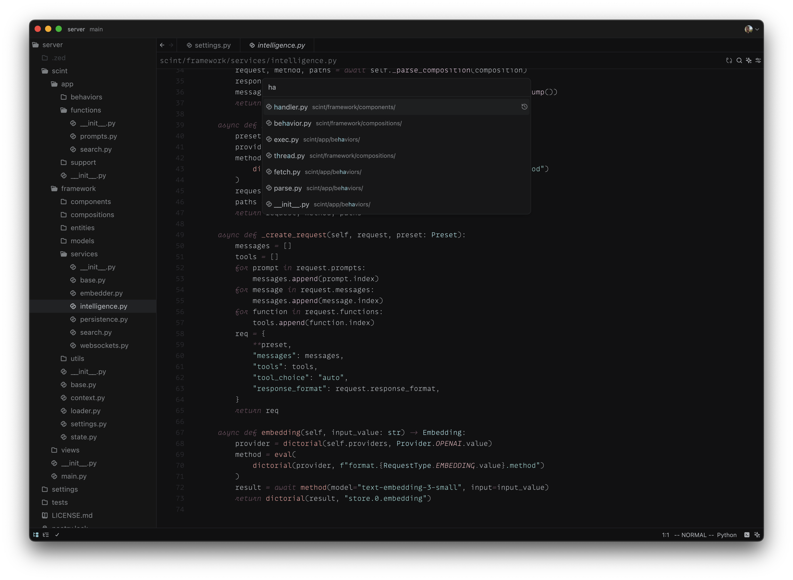
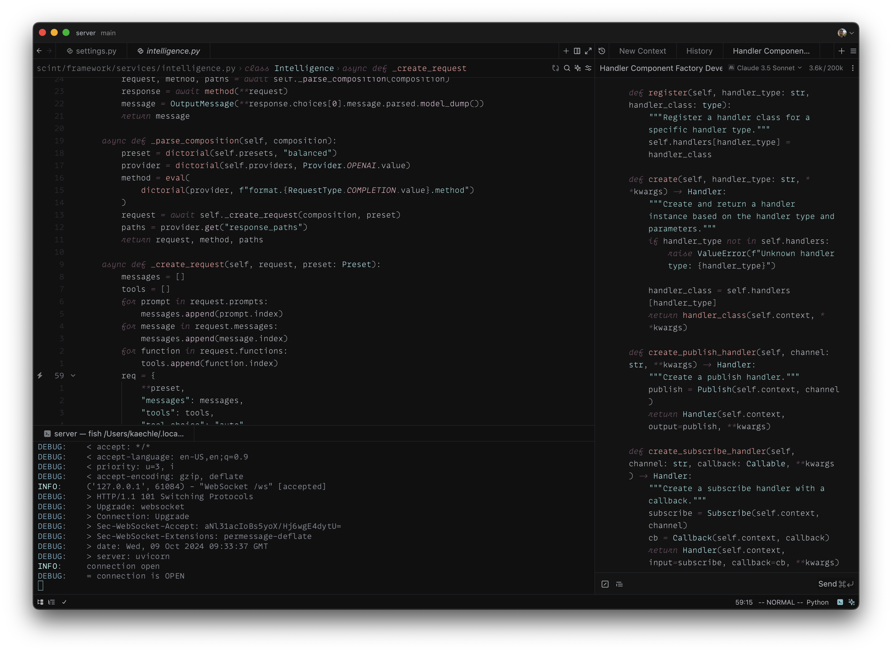

# Aventura

A minimalist, unassuming theme for [Zed](https://github.com/zed-industries/zed). Aventura is a native-esque interface framing a velveteen, low contrast syntax theme. It represents an ongoing, possibly obsessive effort to craft a text editing experience that feels both monochromatic and colorful. A dusting of color clarifies structure when scanning, but fades from focus when composing. For the weary-eyed engineer inundated by clown car color palettes, it's distinction without distraction.

